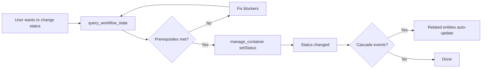

# query_workflow_state - Complete Workflow State Query

**Permission**: 🔍 READ-ONLY

**Category**: Workflow Tools (v2.0)

**Purpose**: Query comprehensive workflow state for any container including current status, active flow, allowed transitions, detected cascade events, and prerequisite validation.

## Overview

The `query_workflow_state` tool is a read-only MCP tool that retrieves complete workflow information for a task, feature, or project. It provides a comprehensive view of:

1. **Current status** and **active workflow flow** (based on entity tags)
2. **Allowed transitions** from the current status (based on config)
3. **Detected cascade events** that may trigger status changes in related entities
4. **Prerequisites for each allowed transition** (what must be met before transitioning)

This tool is ideal for understanding workflow state **before making status changes**. Use it to:
- Check what status transitions are valid
- Identify what prerequisites need to be met
- Preview cascade events that will trigger
- Debug workflow issues

**Complementary Tools**:
- `get_next_status` - Get intelligent recommendations for next status (AI-friendly)
- `manage_container` (setStatus) - Apply status changes after validation

## Quick Start

### Basic Usage

Query workflow state for a task:

```json
{
  "containerType": "task",
  "id": "a1b2c3d4-e5f6-4a5b-8c9d-0e1f2a3b4c5d"
}
```

### Response Example

```json
{
  "success": true,
  "message": "Workflow state retrieved successfully",
  "data": {
    "id": "a1b2c3d4-e5f6-4a5b-8c9d-0e1f2a3b4c5d",
    "containerType": "task",
    "currentStatus": "in-progress",
    "activeFlow": "default_flow",
    "allowedTransitions": ["testing", "blocked", "on-hold", "cancelled"],
    "detectedEvents": [],
    "prerequisites": {
      "testing": {
        "met": false,
        "requirements": [
          "Summary must be 300-500 characters",
          "No incomplete blocking dependencies"
        ],
        "blockingReasons": [
          "Summary too short: 50 characters (need 300-500)"
        ]
      },
      "blocked": {
        "met": true,
        "requirements": ["Emergency transition - no prerequisites"]
      }
    }
  }
}
```

## Parameters

| Parameter | Type | Required | Description |
|-----------|------|----------|-------------|
| `containerType` | enum | **Yes** | Type of container: `task`, `feature`, or `project` |
| `id` | UUID string | **Yes** | Container ID to query workflow state for |

## Response Schema

### Success Response

```json
{
  "success": boolean,
  "message": "Human-readable message",
  "data": {
    "id": "UUID string",
    "containerType": "task|feature|project",
    "currentStatus": "string",
    "activeFlow": "string",
    "allowedTransitions": ["string array"],
    "detectedEvents": [/* cascade events array */],
    "prerequisites": {/* status prerequisites map */}
  }
}
```

### Response Fields

| Field | Type | Description |
|-------|------|-------------|
| `id` | UUID string | Container ID that was queried |
| `containerType` | string | Type: `task`, `feature`, or `project` |
| `currentStatus` | string | Current status of the container |
| `activeFlow` | string | Active workflow flow name (e.g., `"default_flow"`, `"bug_fix_flow"`) |
| `allowedTransitions` | array | List of statuses you can transition to from current status |
| `detectedEvents` | array | Cascade events detected for this container (see [Cascade Events](#cascade-events)) |
| `prerequisites` | object | Map of status → prerequisite validation (see [Prerequisites](#prerequisites)) |

### Cascade Events

When a status change triggers cascading effects on related entities:

```json
"detectedEvents": [
  {
    "event": "first_task_started",
    "targetType": "feature",
    "targetId": "feature-uuid",
    "targetName": "Payment Processing",
    "currentStatus": "planning",
    "suggestedStatus": "in-development",
    "flow": "default_flow",
    "automatic": true,
    "reason": "First task started in feature"
  }
]
```

**Fields**:
- `event` - Event name (e.g., `first_task_started`, `all_tasks_complete`)
- `targetType` - Entity type that will be affected (`task`, `feature`, `project`)
- `targetId` / `targetName` - Affected entity identification
- `currentStatus` - Current status of the affected entity
- `suggestedStatus` - Recommended next status for the affected entity
- `flow` - Active workflow flow for the affected entity
- `automatic` - Whether cascade should happen automatically
- `reason` - Human-readable explanation

### Prerequisites

For each allowed transition, shows whether prerequisites are met:

```json
"prerequisites": {
  "testing": {
    "met": false,
    "requirements": [
      "Summary must be 300-500 characters",
      "No incomplete blocking dependencies"
    ],
    "blockingReasons": [
      "Summary too short: 50 characters (need 300-500)"
    ]
  },
  "blocked": {
    "met": true,
    "requirements": ["Emergency transition - no prerequisites"]
  }
}
```

**Fields**:
- `met` (boolean) - Whether all prerequisites are met
- `requirements` (array) - List of all requirements for this transition
- `blockingReasons` (array) - Specific reasons why prerequisites not met (only present if `met: false`)

## Use Cases

### Use Case 1: Pre-Flight Check Before Status Change

**Scenario**: Before marking a task complete, check if prerequisites are met.

```json
// Query workflow state
{
  "containerType": "task",
  "id": "task-uuid"
}

// Response shows:
"prerequisites": {
  "completed": {
    "met": false,
    "requirements": ["Summary must be 300-500 characters"],
    "blockingReasons": ["Summary too short: 45 characters (need 300-500)"]
  }
}

// Fix the blocker:
// manage_container(operation="update", id="task-uuid", summary="[add 255+ characters]")

// Then retry status change:
// manage_container(operation="setStatus", id="task-uuid", status="completed")
```

### Use Case 2: Understanding Cascade Events

**Scenario**: Check what will happen when you complete the last task in a feature.

```json
// Query workflow state for the task
{
  "containerType": "task",
  "id": "last-task-uuid"
}

// Response shows detected cascade events:
"detectedEvents": [
  {
    "event": "all_tasks_complete",
    "targetType": "feature",
    "targetId": "feature-uuid",
    "targetName": "User Authentication",
    "currentStatus": "in-development",
    "suggestedStatus": "testing",
    "automatic": true,
    "reason": "All tasks in feature are complete"
  }
]
```

This tells you that completing this task will automatically trigger the feature to move from `in-development` → `testing`.

### Use Case 3: Debugging Workflow Issues

**Scenario**: Status change failed. Understand why.

```json
// Query workflow state
{
  "containerType": "feature",
  "id": "feature-uuid"
}

// Response shows:
"currentStatus": "in-development",
"allowedTransitions": ["testing", "blocked", "on-hold"],
"prerequisites": {
  "testing": {
    "met": false,
    "requirements": ["All tasks must be completed or cancelled"],
    "blockingReasons": [
      "2 tasks not completed: \"Add tests\" (pending), \"Update docs\" (in-progress)"
    ]
  }
}
```

Now you know exactly what's blocking the transition and can fix it.

### Use Case 4: Understanding Allowed Transitions

**Scenario**: What statuses can I transition to from here?

```json
// Query workflow state
{
  "containerType": "task",
  "id": "task-uuid"
}

// Response shows:
"currentStatus": "in-progress",
"allowedTransitions": ["testing", "in-review", "blocked", "on-hold", "cancelled"],
"activeFlow": "with_review"
```

The `allowedTransitions` array shows all valid next statuses from the current position, including:
- **Forward transitions** (testing, in-review)
- **Emergency transitions** (blocked, on-hold, cancelled)

## Workflow Configuration

The `allowedTransitions` and prerequisites are determined by your `.taskorchestrator/config.yaml`:

### Status Flows

```yaml
status_progression:
  tasks:
    default_flow: [backlog, pending, in-progress, testing, completed]
    bug_fix_flow: [pending, in-progress, testing, completed]  # Skip backlog

    flow_mappings:
      - tags: [bug, bugfix]
        flow: bug_fix_flow
```

**How active flow is determined**:
1. Check task tags against `flow_mappings`
2. If tags match, use that flow
3. Otherwise, use `default_flow`

### Prerequisites

```yaml
status_validation:
  validate_prerequisites: true  # Enable prerequisite checking
```

**Task prerequisites** (enforced by StatusValidator):
- `in-progress` - No incomplete blocking dependencies
- `completed` - Summary must be 300-500 characters

**Feature prerequisites**:
- `in-development` - Must have ≥1 task
- `testing` - All tasks completed or cancelled

**Project prerequisites**:
- `completed` - All features completed

## Integration with Other Tools

### Workflow Pattern



### Complementary Tools

**Before status change**:
1. `query_workflow_state` - Get complete workflow picture
2. `get_next_status` - Get AI recommendation (uses query_workflow_state internally)

**Apply status change**:
3. `manage_container` (operation="setStatus") - Execute the transition

**After status change**:
4. Check response for cascade events
5. Query affected entities if needed

## Error Handling

### Invalid Container Type

```json
{
  "success": false,
  "message": "Invalid containerType: widget",
  "error": "Validation error"
}
```

**Fix**: Use `task`, `feature`, or `project`.

### Container Not Found

```json
{
  "success": false,
  "message": "Container not found",
  "error": "Entity not found"
}
```

**Fix**: Verify the container ID exists using `query_container` with `operation="get"`.

### Invalid UUID Format

```json
{
  "success": false,
  "message": "Invalid ID format. Must be a valid UUID.",
  "error": "Validation error"
}
```

**Fix**: Ensure ID is a valid UUID string.

## Best Practices

### 1. Always Check Before Status Changes

**Don't**:
```javascript
// Blindly attempt status change
manage_container(operation="setStatus", status="completed")
```

**Do**:
```javascript
// Check workflow state first
state = query_workflow_state(containerType="task", id="...")
if (state.prerequisites.completed.met) {
  manage_container(operation="setStatus", status="completed")
} else {
  // Handle blockers
  console.log(state.prerequisites.completed.blockingReasons)
}
```

### 2. Monitor Cascade Events

```javascript
// Check for cascades before completing last task
state = query_workflow_state(containerType="task", id="last-task")
if (state.detectedEvents.length > 0) {
  console.log("Completing this task will trigger:", state.detectedEvents)
}
```

### 3. Use for Debugging

When a status change fails unexpectedly:
1. Query workflow state
2. Check `prerequisites` object
3. Review `blockingReasons` for each transition
4. Fix identified issues
5. Retry status change

## Related Documentation

- [get_next_status](get-next-status.md) - Get intelligent recommendations
- [manage_container](manage-container.md) - Apply status changes
- [status-progression.md](../status-progression.md) - Complete status workflow guide
- [config.yaml reference](../status-progression.md#workflow-configuration) - Configure workflows and prerequisites

## Version History

- **v2.0.0** - Initial release with event-driven status progression support
- **v2.0.0-beta** - Added prerequisite validation for allowed transitions
- **v2.0.0-beta** - Added cascade event detection
