# Task Orchestrator - Workflow State Diagram

**Last Updated**: 2025-01-24
**Version**: v2.0 (Event-Driven Status Progression)

This document provides comprehensive state diagrams showing how the Task Orchestrator system manages features, tasks, and workflows through Skills and Subagents.

**Key v2.0 Update**: Status transitions are now **event-driven** and **config-agnostic**. Skills detect universal workflow events (e.g., `first_task_started`, `all_tasks_complete`) and delegate to Status Progression Skill, which reads the user's `config.yaml` to determine the next status. The diagrams below show the **default_flow** as an example, but actual flows are determined by user configuration and entity tags.

## High-Level Architecture


## Entity Status Lifecycles

### Feature Lifecycle (default_flow example)

**Note**: This shows `default_flow` as configured in `.taskorchestrator/config.yaml`. Actual flow depends on feature tags and user configuration (e.g., `rapid_prototype_flow` skips testing, `with_review_flow` adds pending-review status).


### Task Lifecycle (default_flow example)

**Note**: This shows `default_flow` as configured in `.taskorchestrator/config.yaml`. Actual flow depends on task tags and user configuration (e.g., `with_review_flow` adds in-review status, `documentation_flow` may skip testing).

```mermaid
stateDiagram-v2
    [*] --> backlog: Task Created

    backlog --> in_progress: Event: work_started<br/>(delegated to Status Progression Skill)

    in_progress --> testing: Event: implementation_complete<br/>(delegated to Status Progression Skill)
    in_progress --> blocked: Event: blocker_detected<br/>(emergency transition)

    testing --> completed: Event: tests_passed<br/>(delegated to Status Progression Skill)
    testing --> in_progress: Event: tests_failed<br/>(backward if allow_backward: true)

    blocked --> in_progress: Blocker Resolved<br/>(resume work)
    blocked --> cancelled: Task No Longer Needed<br/>(emergency transition)

    backlog --> cancelled: Task Not Needed<br/>(emergency transition)
    in_progress --> cancelled: Scope Change<br/>(emergency transition)

    completed --> [*]
    cancelled --> [*]

    note right of backlog
        Initial Status:
        ✅ Task created with title
        ✅ Feature assigned (optional)
        ✅ Can be prioritized/organized
        ❌ No blockers checked yet
    end note

    note right of in_progress
        Prerequisites (enforced by StatusValidator):
        ✅ All BLOCKS dependencies completed
        ❌ Blocked if any blocker incomplete

        Event Detection:
        work_started triggered when
        specialist begins implementation
    end note

    note right of testing
        Prerequisites (config-driven):
        ✅ Summary populated (300-500 chars)
        ✅ Sections updated by specialist

        Event Detection:
        implementation_complete triggered when
        summary length valid && sections updated
    end note

    note right of completed
        Prerequisites (enforced by StatusValidator):
        ✅ Summary 300-500 characters
        ✅ No incomplete BLOCKS dependencies
        ❌ Blocked if summary missing/wrong length
        ❌ Blocked if blockers incomplete

        Event: tests_passed or completion_requested
        Flow determines if testing required
    end note
```



### Project Lifecycle


## Skill Coordination Workflows

### Feature Orchestration Skill Flow


### Task Orchestration Skill Flow


### Status Progression Skill Flow


### Dependency Analysis Skill Flow


## Subagent Workflows

### Feature Architect (Opus) - Feature Design


### Planning Specialist (Sonnet) - Task Breakdown

```mermaid
flowchart TD
    Launch([Launched by:<br/>Feature Orchestration Skill]) --> ReadFeature[Read Feature via<br/>query_container]

    ReadFeature --> IdentifyDomains[Identify Domains:<br/>database, backend,<br/>frontend, testing, docs]

    IdentifyDomains --> CreateTasks[Create Domain-Isolated<br/>Tasks with Templates]

    CreateTasks --> CreateDeps[Create Dependencies<br/>via manage_dependency]

    CreateDeps --> BuildGraph[Build Execution Graph:<br/>Batches by Dependency Level]

    BuildGraph --> UpdateSections[Update Feature Sections:<br/>- Task Breakdown<br/>- Execution Graph]

    UpdateSections --> ReturnGraph[Return: Execution Graph<br/>Batch 1: [T1, T3] parallel<br/>Batch 2: [T2] depends on T1<br/>Next: Task Orchestration Skill]

    ReturnGraph --> End([Sonnet Work Complete<br/>50-100 token summary])

    style CreateTasks fill:#e1e5f5
    style CreateDeps fill:#e1e5f5
    style BuildGraph fill:#ffe1a8
    style ReturnGraph fill:#fff3cd
```

### Implementation Specialist (Haiku) - Standard Implementation


### Senior Engineer (Sonnet) - Complex Problem Solving


## Decision Trees

### Main Orchestrator Decision Tree


### Feature Creation Decision Tree


### Task Execution Decision Tree


### Implementation Work Decision Tree


## Parallel Execution Flow

### Dependency-Aware Batching


## Configuration-Driven Status Validation

### Status Progression with get_next_status

```mermaid
flowchart TD
    UserRequest([User Asks:<br/>"What's next?"<br/>"Can I complete?"]) --> StatusSkill[Status Progression Skill<br/>MANDATORY]

    StatusSkill --> CallTool[Call get_next_status tool<br/>Read-Only Analysis]

    CallTool --> ToolReads[Tool Reads:<br/>1. .taskorchestrator/config.yaml<br/>2. Entity status & tags<br/>3. Task counts, dependencies]

    ToolReads --> AnalyzeFlow[Analyze Flow:<br/>1. Match tags to flow<br/>2. Find current position<br/>3. Check prerequisites<br/>4. Recommend next status]

    AnalyzeFlow --> Result{Result<br/>Type?}

    Result -->|Ready| ShowReady[Return:<br/>✅ recommendedStatus: "testing"<br/>✅ activeFlow: "bug_fix_flow"<br/>✅ currentPosition: 2/4<br/>✅ matchedTags: ["bug", "backend"]]

    Result -->|Blocked| ShowBlocked[Return:<br/>❌ blockers:<br/>- "Task summary required"<br/>- "2 tasks not completed"<br/>✅ currentStatus: "in-progress"]

    Result -->|Terminal| ShowTerminal[Return:<br/>✅ terminalStatus: "completed"<br/>ℹ️ No further progression]

    ShowReady --> SkillGuides[Skill Guides User:<br/>"Try manage_container<br/>with status=testing"<br/>"StatusValidator will check"]

    ShowBlocked --> SkillExplains[Skill Explains:<br/>"Your config requires:<br/>- Summary 300-500 chars<br/>- Complete dependencies first"]

    ShowTerminal --> SkillInforms[Skill Informs:<br/>"At final status<br/>No more transitions"]

    SkillGuides --> UserTries[User Tries Transition<br/>via manage_container]
    SkillExplains --> UserFixes[User Resolves<br/>Blockers]
    UserFixes --> CallTool

    UserTries --> WriteTime{StatusValidator<br/>Write-Time Check}

    WriteTime -->|Pass| Success[✅ Status Changed]
    WriteTime -->|Fail| ValidationError[❌ Validation Error]

    ValidationError --> SkillInterprets[Skill Interprets Error:<br/>"Your config has:<br/>enforce_sequential: true<br/>You must go through in-progress"]

    SkillInterprets --> UserAdjusts[User Adjusts Approach]
    UserAdjusts --> CallTool

    Success --> Done([Status Updated])
    SkillInforms --> Done

    style StatusSkill fill:#e1f5e1
    style CallTool fill:#e1f5e1
    style ToolReads fill:#ffe1a8
    style WriteTime fill:#fff3cd
    style SkillInterprets fill:#fff3cd
```

## Complete Feature Lifecycle Example

### End-to-End: Feature Creation → Task Execution → Completion

```mermaid
sequenceDiagram
    actor User
    participant Orchestrator as Task Orchestrator<br/>Output Style
    participant FeatSkill as Feature Orchestration<br/>Skill
    participant Architect as Feature Architect<br/>Opus
    participant Planning as Planning Specialist<br/>Sonnet
    participant TaskSkill as Task Orchestration<br/>Skill
    participant ImplSpec as Implementation Specialist<br/>Haiku (×3)
    participant StatusSkill as Status Progression<br/>Skill
    participant Database as SQLite Database

    User->>Orchestrator: "Create OAuth integration feature"
    Orchestrator->>FeatSkill: Activate (complex feature)
    FeatSkill->>FeatSkill: Assess: Complex (>200 chars, multiple components)
    FeatSkill-->>Orchestrator: Recommend: Launch Feature Architect
    Orchestrator->>Architect: Launch with user request

    Architect->>Database: query_templates(targetEntityType="FEATURE")
    Database-->>Architect: Templates list
    Architect->>Database: Create feature with Security + API templates
    Database-->>Architect: Feature created (planning status)
    Architect->>Database: Create feature sections (Requirements, Context)
    Architect-->>Orchestrator: Feature created, recommend Planning Specialist

    Orchestrator->>Planning: Launch for task breakdown
    Planning->>Database: query_container(feature-id)
    Database-->>Planning: Feature details
    Planning->>Planning: Identify domains: database, backend, frontend, testing
    Planning->>Database: Create 8 domain-isolated tasks with templates
    Planning->>Database: Create BLOCKS dependencies
    Planning->>Database: Update feature sections (execution graph)
    Planning-->>Orchestrator: Execution graph: Batch 1 (T1, T3), Batch 2 (T2), Batch 3 (T4-T8)

    User->>Orchestrator: "Execute tasks"
    Orchestrator->>TaskSkill: Activate (task execution)
    TaskSkill->>Database: Query all tasks + dependencies
    Database-->>TaskSkill: Tasks with dependency info
    TaskSkill->>TaskSkill: Trust Planning Specialist's graph (no re-analysis)
    TaskSkill-->>Orchestrator: Launch Batch 1 in parallel: T1 (database), T3 (frontend)

    Orchestrator->>ImplSpec: Launch Specialist #1 (T1: database schema)
    Note over ImplSpec: Loads database-implementation Skill
    ImplSpec->>Database: query_container(task-id, includeSections=true)
    Database-->>ImplSpec: Task details
    ImplSpec->>ImplSpec: Implement database schema
    ImplSpec->>Database: Update sections (Implementation Details, Files Changed)
    ImplSpec->>Database: Update summary (300-500 chars)
    ImplSpec->>StatusSkill: Mark task complete
    StatusSkill->>Database: get_next_status(task-id)
    Database-->>StatusSkill: Ready for completed (prerequisites met)
    StatusSkill->>Database: manage_container(setStatus, completed)
    Database-->>StatusSkill: ✅ Status changed
    StatusSkill-->>ImplSpec: Task marked complete
    ImplSpec-->>Orchestrator: T1 complete (brief summary)

    Orchestrator->>ImplSpec: Launch Specialist #2 (T3: UI components)
    Note over ImplSpec: Loads frontend-implementation Skill
    Note over ImplSpec: Similar self-service lifecycle as T1
    ImplSpec-->>Orchestrator: T3 complete (brief summary)

    Orchestrator->>TaskSkill: Batch 1 complete, cascade check
    TaskSkill->>Database: query_dependencies for newly unblocked tasks
    Database-->>TaskSkill: T2 now ready (T1 complete)
    TaskSkill-->>Orchestrator: Launch Batch 2: T2 (backend API)

    Orchestrator->>ImplSpec: Launch Specialist #3 (T2: backend API)
    Note over ImplSpec: Loads backend-implementation Skill
    Note over ImplSpec: Self-service lifecycle
    ImplSpec-->>Orchestrator: T2 complete (brief summary)

    Note over Orchestrator,ImplSpec: ... Continue Batch 3 execution ...

    Orchestrator->>FeatSkill: All tasks complete, check feature
    FeatSkill->>Database: query_container(operation="overview", feature-id)
    Database-->>FeatSkill: taskCounts.completed = 8 (all tasks done)
    FeatSkill->>StatusSkill: Auto move to testing
    StatusSkill->>Database: get_next_status(feature-id)
    Database-->>StatusSkill: Ready for testing (all tasks complete)
    StatusSkill->>Database: manage_container(setStatus, testing)
    Database-->>StatusSkill: ✅ Status changed
    StatusSkill-->>FeatSkill: Feature in testing
    FeatSkill-->>Orchestrator: Feature moved to testing, tests triggered

    Note over Orchestrator: Tests run (via hooks/manual)

    Orchestrator->>FeatSkill: Tests passed, complete feature?
    FeatSkill-->>Orchestrator: Ask user for final approval
    Orchestrator->>User: "Mark feature complete?"
    User->>Orchestrator: "Yes"
    Orchestrator->>FeatSkill: User approved completion
    FeatSkill->>StatusSkill: Mark feature complete
    StatusSkill->>Database: get_next_status(feature-id)
    Database-->>StatusSkill: Ready for completed
    StatusSkill->>Database: manage_container(setStatus, completed)
    Database-->>StatusSkill: ✅ Status changed
    StatusSkill-->>FeatSkill: Feature marked complete
    FeatSkill-->>Orchestrator: Feature complete ✅
    Orchestrator->>User: "Feature complete! 8 tasks done, all tests passing"
```



## Prerequisite Validation Matrix

### Task Prerequisites

| Status Transition | Prerequisites Checked | Validation Timing | Who Validates |
|---|---|---|---|
| pending → in-progress | All BLOCKS dependencies completed | Write-time | StatusValidator |
| in-progress → testing | None | Write-time | StatusValidator |
| testing → completed | Summary 300-500 chars<br/>No incomplete BLOCKS dependencies | Write-time | StatusValidator |
| * → blocked | None (emergency) | Write-time | StatusValidator |
| * → cancelled | None (emergency) | Write-time | StatusValidator |

### Feature Prerequisites

| Status Transition | Prerequisites Checked | Validation Timing | Who Validates |
|---|---|---|---|
| planning → in-development | ≥1 task created | Write-time | StatusValidator |
| in-development → testing | All tasks completed/cancelled | Write-time | StatusValidator |
| testing → validating | All tasks completed/cancelled | Write-time | StatusValidator |
| validating → completed | All tasks completed/cancelled | Write-time | StatusValidator |
| * → cancelled | None (emergency) | Write-time | StatusValidator |

### Project Prerequisites

| Status Transition | Prerequisites Checked | Validation Timing | Who Validates |
|---|---|---|---|
| planning → active | None | Write-time | StatusValidator |
| active → completed | All features completed | Write-time | StatusValidator |

## Token Optimization Strategies

### Query Pattern Efficiency

| Pattern | Tokens | Use Case |
|---|---|---|
| `query_container(operation="get", includeSections=true)` | ~18,500 | Full documentation needed |
| `query_container(operation="overview")` | ~1,200 | Status check, task counts (91% savings) |
| `query_container(operation="search")` | ~30/task | Finding tasks by criteria (89% savings) |

### Specialist Communication

| Pattern | Tokens | Description |
|---|---|---|
| Return full code in response | ~2,000-5,000 | ❌ Token waste |
| Return brief summary, code in sections | ~50-100 | ✅ Efficient (95% savings) |
| Planning Specialist execution graph | ~80-120 | ✅ Reusable by Task Orchestration |
| Re-analyze dependencies | ~300-400 | ❌ Redundant if graph exists |

## Key Patterns Summary

### Always Use Skills For (Mandatory)
- ✅ Feature lifecycle → Feature Orchestration Skill
- ✅ Task execution → Task Orchestration Skill
- ✅ Status changes → Status Progression Skill
- ✅ Dependency checks → Dependency Analysis Skill

### Always Ask User For (User Choice)
- ⚠️ Implementation work → Direct vs Specialist?
- ⚠️ Blocker resolution → Quick fix vs Specialist?
- ⚠️ Small edits → Direct vs Specialist?
- ⚠️ Feature completion → Final approval needed

### Specialist Self-Service Pattern
1. Read task via `query_container(includeSections=true)`
2. Perform work (code, tests, docs)
3. Update sections via `manage_sections`
4. Update summary (300-500 chars) via `manage_container`
5. Use Status Progression Skill to mark complete (validates prerequisites)
6. Return brief summary (50-100 tokens), NOT full implementation

### Prerequisite Validation Pattern
1. Attempt status change via Status Progression Skill
2. Skill delegates to `get_next_status` (read-only recommendation)
3. User tries transition via `manage_container(setStatus)`
4. StatusValidator validates prerequisites at write-time
5. If validation fails → Skill interprets error, explains config rules
6. User resolves blocker, retries via Status Progression Skill

---

**Legend:**
- 🟢 Green = Skills (lightweight coordination, 300-800 tokens)
- 🔵 Blue = Subagents (complex implementation, 1500-2200 tokens)
- 🟡 Yellow = Decision points / validation gates
- 🟠 Orange = Automatic transitions
